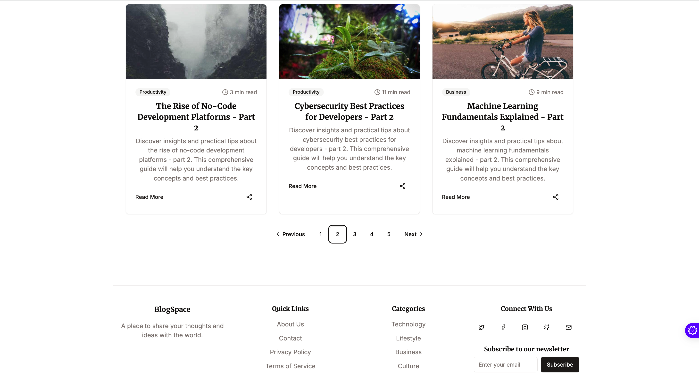
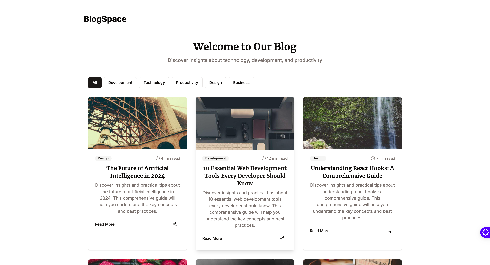

l# Blog Essence Guide 📝


A modern, feature-rich blogging platform built with React, TypeScript, and shadcn-ui. Share your thoughts, ideas, and stories with style!

## ✨ Features



- 📱 Responsive Design - Perfect viewing experience across all devices
- 🎨 Modern UI with shadcn-ui components
- 📂 Category-based post organization
- ⚡ Fast and optimized performance
- 📝 Rich text editing for blog posts
- 🔍 Search and filter functionality
- 📊 Admin dashboard for content management

## 🚀 Getting Started

### Prerequisites

- Node.js (v14 or higher)
- npm or yarn package manager

### Installation

1. Clone the repository
```bash
git clone https://github.com/yourusername/blog-essence-guide.git
```

2. Navigate to the project directory
```bash
cd blog-essence-guide
```

3. Install dependencies
```bash
npm install
# or
yarn install
```

4. Start the development server
```bash
npm run dev
# or
yarn dev
```


## 🛠️ Tech Stack

- **Frontend Framework**: React with TypeScript
- **Styling**: Tailwind CSS
- **UI Components**: shadcn-ui
- **Build Tool**: Vite
- **Form Handling**: React Hook Form
- **Notifications**: Sonner

## 📖 Usage

### Creating a Blog Post

1. Navigate to the Admin Dashboard
2. Click on "Create New Post"
3. Fill in the required fields:
   - Title
   - Content
   - Category
   - Featured Image
4. Click "Publish"


### Managing Categories

- Access the category management section
- Add, edit, or delete categories
- Organize posts by assigning categories

## 🤝 Contributing

We welcome contributions! Here's how you can help:

1. Fork the repository
2. Create your feature branch (`git checkout -b feature/AmazingFeature`)
3. Commit your changes (`git commit -m 'Add some AmazingFeature'`)
4. Push to the branch (`git push origin feature/AmazingFeature`)
5. Open a Pull Request

## 📄 License

This project is licensed under the MIT License - see the [LICENSE](LICENSE) file for details.

## 🙏 Acknowledgments

- [React](https://reactjs.org/)
- [Vite](https://vitejs.dev/)
- [shadcn-ui](https://ui.shadcn.com/)
- [Tailwind CSS](https://tailwindcss.com/)

## 📞 Contact

For questions and support, please open an issue in the repository.

---

Made with ❤️ by [Your Name]


